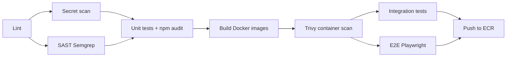
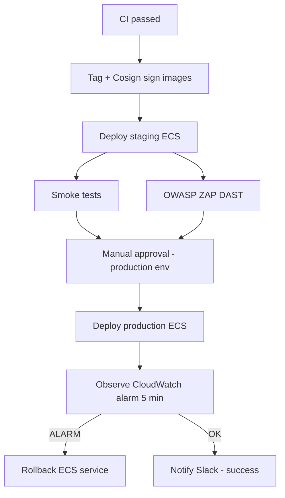

# Planify

**Collaborative project and task management for organizations** — built as a full-stack web application with production-grade DevOps: automated CI/CD, container security, infrastructure as code on AWS, and safe progressive deployments.

---

## Table of contents

1. [Project overview](#project-overview)
2. [Key features](#key-features)
3. [Application architecture](#application-architecture)
4. [Cloud architecture (AWS)](#cloud-architecture-aws)
5. [DevOps pipeline](#devops-pipeline)
6. [Security and quality](#security-and-quality)
7. [Repository structure](#repository-structure)
8. [Getting started](#getting-started)
9. [Testing](#testing)
10. [Infrastructure (Terraform)](#infrastructure-terraform)
11. [API overview](#api-overview)
12. [Presentation guide](#presentation-guide)

---

## Project overview

**Planify** is a multi-tenant SaaS-style application that lets teams organize work inside **organizations**. Each organization can manage **projects**, **tasks** (with statuses and priorities), **members** (with roles), **comments**, **activity logs**, and **analytics**.

The project demonstrates:

| Area | What we implemented |
|------|---------------------|
| **Application** | React SPA + Node.js REST API + PostgreSQL (Prisma ORM) |
| **Packaging** | Multi-stage Docker images for frontend and backend |
| **CI** | Lint, secret scan, SAST, tests, dependency audit, Trivy, E2E, push to ECR |
| **CD** | OIDC to AWS, Cosign image signing, staging deploy, approval gate, production canary + rollback |
| **Infrastructure** | Terraform: VPC networking, RDS, ECS Fargate, ALB, Secrets Manager, CloudWatch alarms |

**Target users:** small teams and organizations that need a lightweight alternative to heavy project-management tools, with clear roles (`admin`, `manager`, `member`) and invitation-based onboarding.

---

## Key features

### Organizations and access control

- User registration and JWT-based authentication
- Organizations with unique slugs
- Member roles: **admin**, **manager**, **member**
- Email invitations and accept-invitation flow

### Project management

- Projects per organization (active, archived, on hold)
- Tasks with Kanban-style statuses: backlog → todo → in progress → in review → done
- Task priorities: low, medium, high, urgent
- Assignees, comments, and activity timeline

### Dashboard and analytics

- Organization dashboard
- Analytics page for organization-level insights

### Operations (for the jury)

- **Docker Compose** for local/demo deployment in one command
- **GitHub Actions** CI on every push/PR to `integrate` and `main`
- **CD pipeline** triggered only after CI succeeds
- **Terraform** for repeatable AWS staging (and optional production alarms)

---

## Application architecture

The browser talks only to the **frontend** (Nginx). Nginx serves the static React build and proxies `/auth/*` and `/api/*` to the **backend**. The backend persists data in **PostgreSQL** via Prisma.

```
                    ┌─────────────────────────────────────────────────┐
                    │                    Browser                        │
                    └─────────────────────┬───────────────────────────┘
                                          │
                                          ▼
                    ┌─────────────────────────────────────────────────┐
                    │  Frontend (Nginx + React/Vite)                   │
                    │  • Static SPA                                    │
                    │  • Proxies /auth/* and /api/* → Backend          │
                    │  • Gzip, rate limiting, security headers         │
                    └─────────────────────┬───────────────────────────┘
                                          │
                    ┌─────────────────────┴───────────────────────────┐
                    ▼                                                  ▼
    ┌───────────────────────────────┐              ┌───────────────────────────────┐
    │  Backend (Node.js / Express)  │              │  PostgreSQL 16                 │
    │  • JWT auth (/auth/*)         │◄────────────►│  Users, orgs, projects,       │
    │  • REST API (/api/*)          │   Prisma     │  tasks, comments, activity    │
    └───────────────────────────────┘              └───────────────────────────────┘
```

### Tech stack

| Layer | Technology |
|-------|------------|
| **Frontend** | React 18, Vite, TypeScript, Tailwind CSS, React Router, Radix UI |
| **Reverse proxy** | Nginx (Alpine) — static files, API proxy, gzip, rate limiting |
| **Backend** | Node.js 20, Express, Prisma, JWT (bcrypt, jsonwebtoken) |
| **Database** | PostgreSQL 16 |
| **Local orchestration** | Docker Compose |
| **Cloud** | AWS ECS Fargate, ALB, RDS, ECR, Secrets Manager, CloudWatch |
| **IaC** | Terraform 1.6+ |
| **CI/CD** | GitHub Actions, OIDC, Cosign, Trivy, Gitleaks, Semgrep, OWASP ZAP |

---

## Cloud architecture (AWS)

Staging (and optional production) workloads run on **Amazon ECS Fargate**. A single ECS task runs two containers: **backend** (port 8000) and **frontend** (port 3000). An **Application Load Balancer** routes HTTP traffic to the frontend target group; the frontend container proxies API calls to the backend on localhost inside the task.

```
  Internet
      │
      ▼
┌─────────────┐     ┌──────────────────────────────────────┐
│     ALB     │────►│  ECS Fargate service (1+ tasks)       │
│  HTTP :80   │     │  ┌────────────┐  ┌────────────┐       │
└─────────────┘     │  │  frontend  │  │  backend   │       │
                    │  │  (Nginx)   │──│  Express   │       │
                    │  └────────────┘  └─────┬──────┘       │
                    └────────────────────────┼──────────────┘
                                               │
                    ┌──────────────────────────┼──────────────────────────┐
                    ▼                          ▼                          ▼
            ┌───────────────┐          ┌───────────────┐          ┌───────────────┐
            │  RDS Postgres │          │  Secrets Mgr  │          │  CloudWatch   │
            │               │          │ DATABASE_URL  │          │ Logs + alarms │
            │               │          │ JWT_SECRET    │          │ (5xx rollback)│
            └───────────────┘          └───────────────┘          └───────────────┘
                    ▲
                    │
            ┌───────────────┐
            │  ECR          │  ← CI pushes signed images
            │ backend/front │
            └───────────────┘
```

**Terraform** in [`planify-terraform/`](planify-terraform/) provisions ECR, security groups, RDS, Secrets Manager, ALB, ECS cluster/service, log groups, and **deploy alarms** (ALB target 5xx) wired to ECS for automatic rollback.

Detailed setup: see [`planify-terraform/README.md`](planify-terraform/README.md).

---

## DevOps pipeline

Two workflows live under [`.github/workflows/`](.github/workflows/):

| Workflow | Trigger | Role |
|----------|---------|------|
| **CI-Pipeline** | Push / PR to `integrate`, `main` | Build, test, scan, push images to ECR |
| **CD-Pipeline** | After CI completes successfully | Sign images, deploy staging → tests → approve → production |

### CI flow (quality gate)



1. **Lint** — ESLint on backend and frontend  
2. **Secret scan** — Gitleaks (full git history)  
3. **SAST** — Semgrep (TypeScript, React, Node.js, OWASP rules)  
4. **Unit tests** — Node test runner + Vitest; `npm audit` at high severity  
5. **Build** — Docker images for backend and frontend (Buildx + GHA cache)  
6. **Container scan** — Trivy (CRITICAL/HIGH); SARIF uploaded to GitHub Security  
7. **Integration tests** — Backend API against PostgreSQL service container  
8. **E2E tests** — Playwright (Chromium) on built frontend  
9. **Push** — Images tagged with `sha-<commit>`, branch name, and `latest` to ECR (OIDC, no long-lived AWS keys)

### CD flow (delivery gate)



- **Authentication to AWS:** GitHub OIDC → IAM roles (`AWS_ROLE_ARN_STAGING` / `AWS_ROLE_ARN_PRODUCTION`) — no static access keys in the repo  
- **Supply chain:** Cosign keyless signatures verified before production deploy  
- **Staging:** Rolling ECS deployment; smoke tests against `STAGING_URL`  
- **Production:** ECS deploy with stability wait; **CloudWatch alarm** on ALB 5xx (`CW_ALARM_PRODUCTION`) observed post-deploy; auto-rollback job if alarm fires  
- **Notifications:** Slack webhook on success and rollback  

### GitHub configuration (summary)

**Environments:** `staging`, `production` (production requires reviewers)

**Secrets (examples):** `AWS_ROLE_ARN_STAGING`, `AWS_ROLE_ARN_PRODUCTION`, `ECS_CLUSTER_*`, `ECS_SERVICE_*`, `CW_ALARM_STAGING`, `CW_ALARM_PRODUCTION`, `ECR_REPOSITORY_*`, `SLACK_WEBHOOK_URL`

**Variables:** `AWS_ACCOUNT_ID`, `AWS_REGION`, `STAGING_URL` (for smoke tests and ZAP)

After `terraform apply`, map outputs to secrets — see [Infrastructure](#infrastructure-terraform).

---

## Security and quality

| Control | Tool / mechanism |
|---------|----------------|
| Static analysis | ESLint, Semgrep |
| Secret detection | Gitleaks |
| Dependency risk | `npm audit` (high+) |
| Container vulnerabilities | Trivy → GitHub Security tab |
| Dynamic testing | Playwright E2E, OWASP ZAP baseline on staging |
| Runtime secrets | AWS Secrets Manager (not in images) |
| Image trust | Cosign signatures tied to GitHub OIDC identity |
| Deploy safety | ECS circuit breaker, CloudWatch 5xx alarms, production approval gate |
| Transport | ALB HTTP (HTTPS can be added with ACM + listener rule) |

For test commands and coverage details, see [`TESTING.md`](TESTING.md).

---

## Repository structure

```
planify/
├── frontend/                 # React SPA, Nginx, Vitest, Playwright
│   ├── src/                  # Pages, components, contexts, API client
│   ├── nginx/                # Reverse proxy configuration
│   └── Dockerfile
├── backend/                  # Express API, Prisma, unit/integration tests
│   ├── routes/               # auth, api
│   ├── controllers/
│   ├── prisma/schema.prisma
│   └── Dockerfile
├── planify-terraform/        # AWS infrastructure (Terraform modules)
├── .github/workflows/
│   ├── CI-Pipeline.yml       # Build, test, scan, push ECR
│   └── CD-Pipeline.yml       # Sign, deploy, observe, rollback
├── docker-compose.yml        # Local full stack
├── TESTING.md                # Testing guide
└── README.md                 # This file
```

---

## Getting started

### Option A — Docker Compose (recommended for demo)

**Prerequisites:** Docker and Docker Compose

```bash
git clone https://github.com/marwaneroman/Planify.git
cd Planify
cp .env.example .env
# Edit .env: POSTGRES_USER, POSTGRES_PASSWORD, POSTGRES_DB, JWT_SECRET

docker compose up --build -d
```

Open **http://localhost** (port 80). Sign up or sign in; the frontend proxies API calls to the backend.

```bash
docker compose logs -f    # Follow logs
docker compose down       # Stop stack
```

### Option B — Local development (hot reload)

**Backend**

```bash
cd backend
cp .env.example .env   # DATABASE_URL, JWT_SECRET, PORT, CORS_ORIGIN
npm install
npx prisma db push
npm run dev            # Default port 3001
```

**Frontend**

```bash
cd frontend
cp .env.example .env   # VITE_API_URL=http://localhost:3001
npm install
npm run dev            # Vite dev server (e.g. http://localhost:8080)
```

PostgreSQL must be running locally or via `docker compose up db -d`.

### Environment variables

| Location | Purpose |
|----------|---------|
| **Root `.env`** | `docker-compose`: `POSTGRES_*`, `JWT_SECRET` |
| **`frontend/.env`** | `VITE_API_URL` for local dev |
| **`backend/.env`** | `DATABASE_URL`, `JWT_SECRET`, `PORT`, `CORS_ORIGIN` |

---

## Testing

From the repository root:

```bash
npm test              # Backend unit + frontend unit (no DB)
npm run test:e2e      # Playwright (from frontend/)
```

CI runs the full matrix automatically. See [`TESTING.md`](TESTING.md) for structure, commands, and CI integration.

---

## Infrastructure (Terraform)

AWS staging infrastructure is defined in [`planify-terraform/`](planify-terraform/).

```bash
cd planify-terraform
cp terraform.tfvars.example terraform.tfvars
# Set vpc_id, public_subnet_ids, database_subnet_ids

terraform init
terraform plan
terraform apply
```

**Outputs → GitHub secrets**

| Terraform output | GitHub secret |
|------------------|---------------|
| `ecs_cluster_name` | `ECS_CLUSTER_STAGING` |
| `ecs_service_name` | `ECS_SERVICE_STAGING` |
| `cloudwatch_deploy_alarm_name` | `CW_ALARM_STAGING` |
| `cloudwatch_production_deploy_alarm_name` | `CW_ALARM_PRODUCTION` |

Production deploy alarm: set `production_alb_name` and `production_target_group_name` in `terraform.tfvars` when production ALB exists.

Full module layout and operations: [`planify-terraform/README.md`](planify-terraform/README.md).

---

## API overview

| Area | Endpoints |
|------|-----------|
| **Auth** | `POST /auth/register`, `POST /auth/login`, `GET /auth/me` (Bearer token) |
| **Organizations** | `GET/POST /api/organizations`, `GET /api/organizations/:id`, members, invitations |
| **Projects** | CRUD under `/api/organizations/:orgId/projects` |
| **Tasks** | CRUD under `/api/projects/:projectId/tasks` |
| **Comments** | `/api/tasks/:taskId/comments` |
| **Activity & analytics** | `/api/organizations/:id/activity`, analytics routes |

---

## Presentation guide

Suggested flow for a **jury demo** (~10–15 minutes):

1. **Problem & solution (1 min)** — Teams need shared projects, tasks, and roles; Planify delivers that with a modern stack and automated delivery.  
2. **Live app (3 min)** — `docker compose up` or staging URL: register → create organization → project → tasks → invite member.  
3. **Architecture (2 min)** — Show application diagram (browser → Nginx → API → PostgreSQL) and AWS diagram (ALB → ECS → RDS).  
4. **CI pipeline (3 min)** — Open GitHub Actions: walk through lint → scan → test → Trivy → ECR push on a green run.  
5. **CD & safety (3 min)** — Explain OIDC, Cosign, staging deploy, approval gate, CloudWatch alarm + rollback.  
6. **Infrastructure as code (2 min)** — Brief `terraform plan` / module tree; mention alarms and Secrets Manager.  
7. **Q&A** — Point to `TESTING.md` and this README for depth.

**Talking points**

- *Why containers?* Same artifact from CI to staging/production.  
- *Why OIDC?* No AWS access keys stored in GitHub.  
- *Why alarms?* Failed deploys roll back before users see sustained errors.  
- *Why tests at multiple levels?* Unit (fast), integration (API + DB), E2E (user flows), DAST (staging attack surface).

---

## License and authors

Academic / portfolio project — Planify team.  
Repository: [github.com/marwaneroman/Planify](https://github.com/marwaneroman/Planify)
